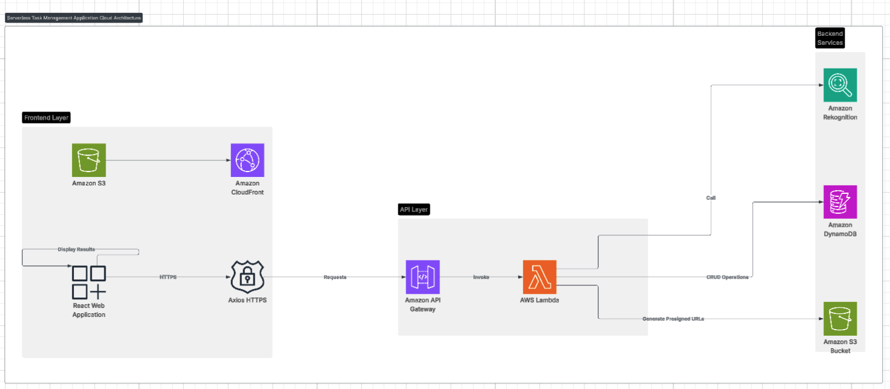

# ServerTask – Serverless Task Management

ServerTask is a fully serverless task management system built with AWS CDK, Lambda, API Gateway, DynamoDB, S3, Rekognition, and a React + Material UI frontend.

The system allows users to:
- Create, view, edit, and delete tasks
- Upload images associated with tasks using secure pre-signed URLs
- Automatically process uploaded images with Amazon Rekognition
- View results in a user-friendly React interface

---

## Tech Stack

| Layer        | Technology Used            |
|-------------|---------------------------|
| **Frontend** | React (TypeScript), Material UI, Axios, React Router |
| **Backend**  | AWS Lambda (Node.js), API Gateway (REST), AWS SDK |
| **Storage**  | DynamoDB (Tasks), S3 (Images) |
| **AI/ML**    | AWS Rekognition (Image Label Detection) |
| **IaC**      | AWS CDK (TypeScript) |

---

## Architecture




---

## Setup Instructions

### Prerequisites
- Node.js 18+
- AWS CLI configured with credentials
- AWS CDK installed globally: `npm install -g aws-cdk`

### 1. Clone the Repository
```bash
git clone https://github.com/your-username/server-task.git
cd server-task
```

### 2. Install dependencies
```bash
npm install
```

### 3. Deploy Infrastructure
```bash
cdk bootstrap    # Only once per AWS account/region
cdk synth
cdk deploy
```

### 4. Configure Frontend
Go to frontend/server-task-frontend/src/api/api.ts
Replace API_BASE with the output API Gateway endpoint from CDK deploy

### 5. Run Frontend Locally
```bash
cd frontend/server-task-frontend
npm install
npm start
```

## Features
- 🗂 **Task Management** – Full CRUD support with DynamoDB
- 🖼 **Image Uploads** – Pre-signed URLs for secure direct S3 uploads
- 🧠 **Image Processing** – Automated image label detection with Rekognition
- 🌐 **Responsive Frontend** – Built with React + Material UI
- ☁️ **Infrastructure as Code** – Reproducible deployments using AWS CDK

## Deployment Guide

### Redeploy Backend
```bash
cd server-task
cdk synth
cdk deploy
```

### Deploy Frontend to S3
```bash
cd frontend/server-task-frontend
npm run build
aws s3 sync build/ s3://<your-frontend-bucket> --delete
```

---

This project demonstrates a **production-ready serverless architecture**:
- ✅ Scalable, cost-effective, and easy to deploy
- ✅ Secure image uploads with pre-signed S3 URLs
- ✅ Automated image analysis with Rekognition
- ✅ Beautiful and responsive UI built with React + Material UI


